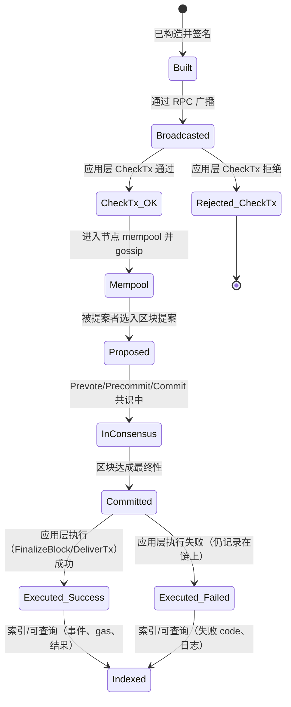
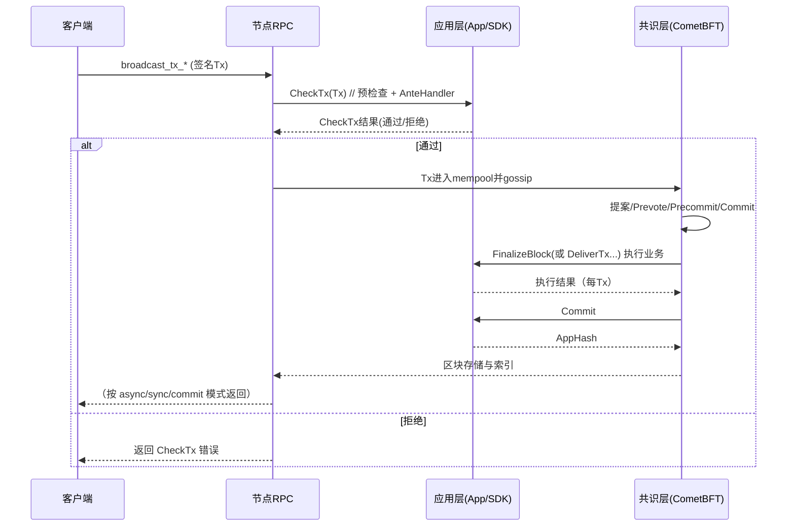

好的，下面把 **gaiad（Gaia / Cosmos SDK + CometBFT）** 中“一笔转账交易从发起到落地”的全生命周期梳理清楚，并给出对应的状态流转图。先给结论：

> **结论**：用户发起后，交易会**先进入业务层（应用层 App）做 `CheckTx` 校验**，通过后进入节点的 **mempool**；随后才进入 **共识层（CometBFT）** 投票达成区块；在区块提交时，**再由业务层执行状态变更（`FinalizeBlock`/`DeliverTx`）并 `Commit`**。
> 也就是：**应用层预检查 → 共识 → 应用层落账**。

---

# 一、参与者与分层

* **客户端**：钱包 / CLI（`gaiad tx bank send ...`），构造、签名并广播交易。
* **节点 RPC**：接收广播（`broadcast_tx_async/sync/commit`），送入 mempool。
* **应用层（Gaia / Cosmos SDK App）**：

  * 预检查：`CheckTx`（含 `AnteHandler`：签名、费用、账户序号/nonce、gas 基础检查等）。
  * 落账：`FinalizeBlock`（或旧接口 `BeginBlock` + `DeliverTx` + `EndBlock`）执行消息（`Msg`s）、事件、索引。
* **共识层（CometBFT，原 Tendermint）**：mempool、提案/投票（Proposal/Prevote/Precommit/Commit）、区块存储。

---

# 二、时间线（从“发起”到“落账”）

1. **构造与签名**

* 客户端用链上参数（`chain-id`、`accSeq`、`fee`、`gas` 等）构造 `Tx`，对其中的 `MsgSend` 等进行**离线签名**。

2. **广播交易（到某个全节点）**

* 通过 RPC `broadcast_tx_*`：

  * **async**：立刻返回（只表示已接收，未告知 `CheckTx` 结果）。
  * **sync**：返回 **`CheckTx` 结果**（通过=0，失败返回错误码与日志）。
  * **commit**：**等待该交易被打包上链**并返回 **`DeliverTx/FinalizeBlock` 结果**与高度（最慢，但最确定）。

3. **应用层预检查 → 进入 mempool**

* 节点把交易交给 App 的 **`CheckTx`**：

  * 运行 **`AnteHandler`**：验签、账户存在、`account number/sequence`、余额与手续费、基本 gas 上限、消息解码与路由等。
  * **通过**：进入本地 **mempool**，并 **gossip** 给其他节点。
  * **失败**：**拒收**（不会进入共识），`broadcast_tx_sync` 会直接返回错误。

4. **提案构建与共识投票**

* **提案者（proposer）**从 mempool 选取若干交易（可由 App 参与 `PrepareProposal`/`ProcessProposal`（ABCI++）来筛选/校验）。
* 共识阶段：**Proposal → Prevote → Precommit → Commit** 达成对区块的最终性（CometBFT 的 BFT 投票流程）。

5. **区块提交时的“落账执行”**

* 当区块达成共识后，CometBFT 调用 App：

  * **ABCI++**（新）：`FinalizeBlock`（对区块中每笔 tx 执行业务逻辑）。
  * **旧接口**：`BeginBlock` → 多次 `DeliverTx` → `EndBlock`。
* **再次执行 `AnteHandler`**（或等效逻辑）：因为账户 `sequence`、余额等可能在 mempool 阶段之后发生变化（比如同账户另一笔更早打包的 tx 已消耗了 nonce/余额），因此这里仍可能**业务执行失败**。
* **业务消息执行（Msg）**：路由到各模块（`bank`, `staking`, `authz`…）Handler / Msg server，写状态树（IAVL/SMT）、产出事件、消耗 gas、收取费用。
* 交易执行结果（成功/失败、gas 使用量、事件、日志）**全部记录**进区块的 `TxResults`。

  * **注意**：即便交易在这里失败（例如 nonce 不匹配），它**仍然可以被包含在区块内**，只不过 `code != 0`，通常**扣除基本 gas/fee**，但**不产生目标状态变更**（例如转账失败不转账）。

6. **状态提交与对外可见**

* App **`Commit`**：计算新状态根（AppHash），返回给共识层；区块头记录这个 AppHash。
* 节点索引器（TxIndexer）记录交易结果，RPC/REST/gRPC 查询即可看到：区块高、`txhash`、`code`、`gas_used`、事件等。

7. **mempool 清理与重检**

* 区块提交后，节点会对 mempool 做 **RecheckTx**（基于新状态再次 `CheckTx`），移除已经上链或已不再有效的交易。

---

# 三、常见分支与错误点

* **在 `CheckTx` 被拒**：签名错、fee 不足、消息解码失败、`sequence` 过小/过大、超出基本 gas 上限等 → 不入 mempool。
* **被包含进区块但在执行时失败**：

  * 典型：与同账户的其他交易竞争 `sequence`；或在落账时余额不足。
  * 结果：`TxResult.code != 0`，**通常费用照扣**（规则以具体模块/链上参数为准），业务状态不生效。
* **交易被 mempool 淘汰**：重检后不再有效或超限被丢弃。
* **提交确认语义**：

  * `broadcast_tx_async`：只代表“收到”。
  * `broadcast_tx_sync`：代表“通过 `CheckTx` 并入池”。
  * `broadcast_tx_commit`：代表“**已上链并执行**”（成功或失败均有确定结果与区块高度）。

---

# 四、从“用户视角”的状态流转

---

# 五、按“层次/调用”的时序图（简化）

---

# 六、关键实现点（Cosmos SDK 语义）

* **`AnteHandler`**：所有交易的前置逻辑（验签、序号、fee、基本 gas 计算、优先级等）。`CheckTx` 与区块执行阶段都会跑（或等价校验）。
* **`Msg` 执行**：转账属于 `bank` 模块的 `MsgSend`，在落账阶段写状态；失败则仅扣费（通常）不转移余额。
* **ABCI++**：现代 Gaia 会通过 `PrepareProposal/ProcessProposal/FinalizeBlock` 让 App 更早参与提案构建与提案校验（例如去除无效 tx、排序等），但总体流程不变：**先应用层预检 → 再共识 → 再应用层落账**。

---

# 七、你可能会用到的实操指令小抄

* 构造/签名/广播：

  * `gaiad tx bank send <from> <to> <amount> --fees <fee> --gas auto --gas-adjustment 1.2 --chain-id <id> --node <rpc> -y`
* 查询交易：

  * `gaiad query tx <txhash>`（看 `code`、`gas_used`、事件、区块高）
* 查询账户序号与余额：

  * `gaiad query auth account <addr>`
  * `gaiad query bank balances <addr>`

---

如果你需要，我也可以把上面的 **状态机图** 或 **时序图** 导出为可打印的 SVG/PNG，或者结合你们 BloFin 的节点参数（`min_gas_price`、mempool 配置、优先级规则）再出一版“生产环境调优版”的流程图。
