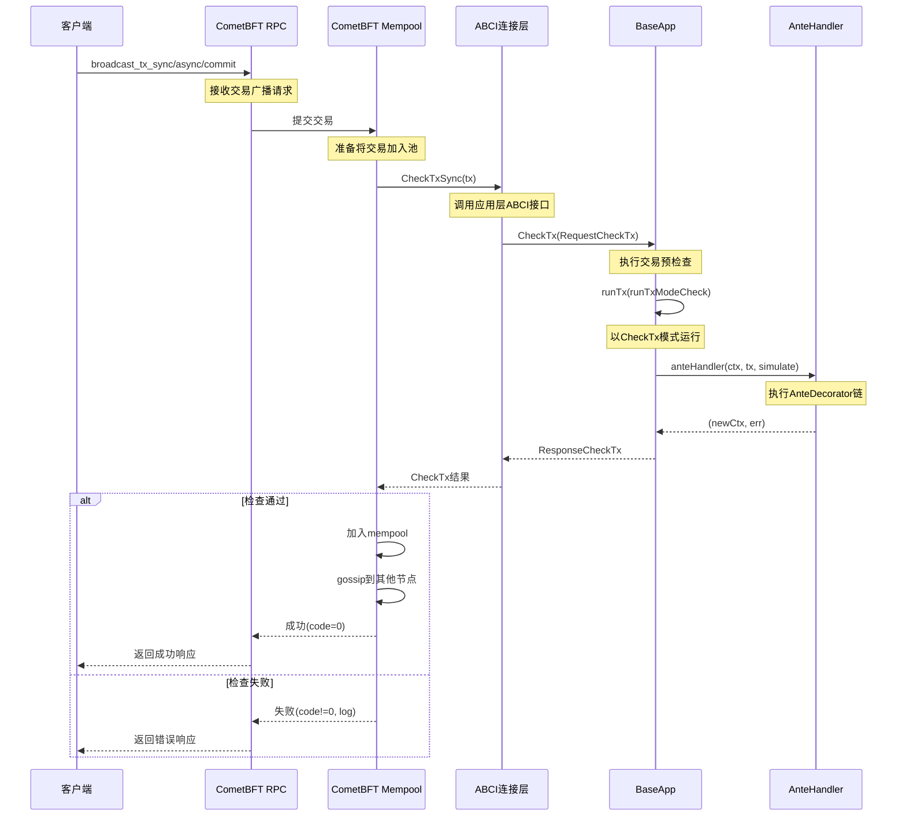

# CheckTx 调用链路分析

## 文档概述

本文档详细梳理 Gaia 节点中业务层 `CheckTx` 方法的调用时机、调用链路和具体代码实现，帮助理解交易从接收到进入 mempool 的完整流程。

---

## 一、CheckTx 是什么？

`CheckTx` 是 **ABCI (Application Blockchain Interface)** 接口定义的核心方法之一，用于在交易进入 mempool 之前对交易进行**预检查验证**。

### 1.1 CheckTx 的作用

- **验证交易的基本有效性**：签名、格式、费用等
- **防止垃圾交易进入 mempool**：节省网络和计算资源
- **快速失败机制**：不合法交易立即拒绝，不参与共识

### 1.2 CheckTx 与 DeliverTx/FinalizeBlock 的区别

| 特性 | CheckTx | DeliverTx/FinalizeBlock |
|------|---------|------------------------|
| **调用时机** | 交易接收时，进入 mempool 前 | 区块达成共识后，执行时 |
| **状态变更** | 不改变链上状态（只读检查） | 会修改链上状态（写入） |
| **执行内容** | AnteHandler（预检查逻辑） | AnteHandler + Msg Handler（完整业务逻辑） |
| **失败结果** | 交易被拒绝，不入 mempool | 交易仍上链，但标记为失败（通常扣费） |

---

## 二、CheckTx 的调用时机

### 2.1 完整调用流程图



### 2.2 三种广播模式的行为

客户端可以选择不同的广播模式，它们在 CheckTx 调用上的差异：

```go
// 1. broadcast_tx_async - 异步模式
// - 节点立即返回（不等待CheckTx结果）
// - 最快，但无法确认交易是否通过预检查

// 2. broadcast_tx_sync - 同步模式（最常用）
// - 等待CheckTx执行完成
// - 返回CheckTx的结果（成功/失败）
// - 适合确认交易是否进入mempool

// 3. broadcast_tx_commit - 提交模式
// - 等待CheckTx + 等待交易上链
// - 返回FinalizeBlock的最终执行结果
// - 最慢，但最确定
```

---

## 三、代码层面的调用链路

### 3.1 GaiaApp 中的 CheckTx 方法继承

**文件位置**：`app/app.go`

```go
// GaiaApp 结构体通过嵌入 BaseApp 继承了 CheckTx 方法
type GaiaApp struct {
    *baseapp.BaseApp    // 嵌入 BaseApp，自动获得其所有方法
    keepers.AppKeepers
    
    legacyAmino       *codec.LegacyAmino
    appCodec          codec.Codec
    txConfig          client.TxConfig
    interfaceRegistry types.InterfaceRegistry
    
    mm           *module.Manager
    ModuleBasics module.BasicManager
    sm           *module.SimulationManager
    configurator module.Configurator
    otelClient   *gaiatelemetry.OtelClient
}
```

**关键点**：
- GaiaApp 没有自己实现 `CheckTx` 方法
- 通过 Go 的**嵌入语法**，`app.CheckTx()` 实际调用的是 `app.BaseApp.CheckTx()`
- BaseApp 来自 Cosmos SDK：`github.com/cosmos/cosmos-sdk/baseapp`

### 3.2 BaseApp 中的 CheckTx 实现

**代码位置**：Cosmos SDK 的 `baseapp/abci.go`（外部依赖）

```go
// BaseApp 实现了完整的 ABCI 接口
// CheckTx 方法签名（概念性展示）
func (app *BaseApp) CheckTx(req *abci.RequestCheckTx) (*abci.ResponseCheckTx, error) {
    // 1. 解码交易
    tx, err := app.txDecoder(req.Tx)
    if err != nil {
        return sdkerrors.ResponseCheckTxWithEvents(err, 0, 0, nil, false), nil
    }

    // 2. 以 CheckTx 模式运行交易
    gInfo, result, anteEvents, err := app.runTx(runTxModeCheck, req.Tx)
    
    // 3. 返回检查结果
    return &abci.ResponseCheckTx{
        GasWanted: int64(gInfo.GasWanted),
        GasUsed:   int64(gInfo.GasUsed),
        Code:      sdkerrors.CodeType(err),
        Data:      result.Data,
        Log:       result.Log,
        Events:    anteEvents.ToABCIEvents(),
        Priority:  result.Priority,
    }, nil
}
```

**核心逻辑**：
1. **解码交易**：使用 `txDecoder` 将字节数组解码为 `sdk.Tx` 对象
2. **执行 runTx**：以 `runTxModeCheck` 模式运行，只执行 AnteHandler，不执行 Msg Handler
3. **返回响应**：包含 gas 消耗、错误码、日志、事件等信息

### 3.3 AnteHandler 的设置与执行

**文件位置**：`app/app.go:298-333`

#### 3.3.1 AnteHandler 的创建

```go
// NewGaiaApp 构造函数中创建 AnteHandler
func NewGaiaApp(...) *GaiaApp {
    // ... 省略其他初始化代码
    
    // 创建 AnteHandler
    anteHandler, err := gaiaante.NewAnteHandler(
        gaiaante.HandlerOptions{
            AccountKeeper:   &app.AccountKeeper,
            BankKeeper:      app.BankKeeper,
            FeegrantKeeper:  app.FeeGrantKeeper,
            SignModeHandler: txConfig.SignModeHandler(),
            SigGasConsumer:  ante.DefaultSigVerificationGasConsumer,

            Codec:                 appCodec,
            IBCkeeper:             app.IBCKeeper,
            StakingKeeper:         app.StakingKeeper,
            FeeMarketKeeper:       app.FeeMarketKeeper,
            WasmConfig:            &wasmConfig,
            TXCounterStoreService: runtime.NewKVStoreService(app.GetKey(wasmtypes.StoreKey)),
            TxFeeChecker: func(ctx sdk.Context, tx sdk.Tx) (sdk.Coins, int64, error) {
                return minTxFeesChecker(ctx, tx, *app.FeeMarketKeeper)
            },
        },
    )
    if err != nil {
        panic(fmt.Errorf("failed to create AnteHandler: %s", err))
    }
    
    // 设置 AnteHandler 到 BaseApp
    app.SetAnteHandler(anteHandler)
    
    // ... 省略其他初始化代码
}
```

#### 3.3.2 AnteHandler 的实现

**文件位置**：`ante/ante.go:51-110`

```go
func NewAnteHandler(opts HandlerOptions) (sdk.AnteHandler, error) {
    // 参数验证
    if opts.AccountKeeper == nil {
        return nil, errorsmod.Wrap(gaiaerrors.ErrLogic, "account keeper is required for AnteHandler")
    }
    // ... 其他验证
    
    sigGasConsumer := opts.SigGasConsumer
    if sigGasConsumer == nil {
        sigGasConsumer = ante.DefaultSigVerificationGasConsumer
    }

    // 构建 AnteDecorator 链
    anteDecorators := []sdk.AnteDecorator{
        ante.NewSetUpContextDecorator(),                    // 1. 设置上下文
        wasmkeeper.NewLimitSimulationGasDecorator(...),     // 2. 限制模拟gas
        wasmkeeper.NewCountTXDecorator(...),                // 3. 交易计数
        ante.NewExtensionOptionsDecorator(...),             // 4. 扩展选项检查
        ante.NewValidateBasicDecorator(),                   // 5. 基础验证
        ante.NewTxTimeoutHeightDecorator(),                 // 6. 超时高度检查
        ante.NewValidateMemoDecorator(...),                 // 7. memo验证
        ante.NewConsumeGasForTxSizeDecorator(...),          // 8. 交易大小gas消耗
        NewGovVoteDecorator(...),                           // 9. 治理投票检查（Gaia特有）
        ante.NewSetPubKeyDecorator(...),                    // 10. 设置公钥
        ante.NewValidateSigCountDecorator(...),             // 11. 签名数量验证
        ante.NewSigGasConsumeDecorator(...),                // 12. 签名gas消耗
        ante.NewSigVerificationDecorator(...),              // 13. 签名验证【核心】
        ante.NewIncrementSequenceDecorator(...),            // 14. 增加账户序列号
        ibcante.NewRedundantRelayDecorator(...),            // 15. IBC冗余中继检查
    }

    // 如果启用了FeeMarket，添加费用检查装饰器
    if UseFeeMarketDecorator {
        anteDecorators = append(anteDecorators,
            feemarketante.NewFeeMarketCheckDecorator(
                opts.AccountKeeper,
                opts.BankKeeper,
                opts.FeegrantKeeper,
                opts.FeeMarketKeeper,
                ante.NewDeductFeeDecorator(             // 16. 扣除手续费
                    opts.AccountKeeper,
                    opts.BankKeeper,
                    opts.FeegrantKeeper,
                    opts.TxFeeChecker)))
    }

    // 链式组合所有装饰器
    return sdk.ChainAnteDecorators(anteDecorators...), nil
}
```

#### 3.3.3 AnteDecorator 链的执行顺序

CheckTx 执行时，AnteHandler 会按照以下顺序执行每个装饰器：

```
1. SetUpContextDecorator        - 初始化执行上下文
2. LimitSimulationGasDecorator   - 限制模拟gas
3. CountTXDecorator              - 统计交易数量
4. ExtensionOptionsDecorator     - 检查扩展选项
5. ValidateBasicDecorator        - 基础格式验证
6. TxTimeoutHeightDecorator      - 检查超时高度
7. ValidateMemoDecorator         - 验证memo字段
8. ConsumeGasForTxSizeDecorator  - 根据交易大小消耗gas
9. GovVoteDecorator              - 治理投票特殊处理（Gaia特有）
10. SetPubKeyDecorator           - 设置账户公钥
11. ValidateSigCountDecorator    - 验证签名数量
12. SigGasConsumeDecorator       - 签名验证消耗gas
13. SigVerificationDecorator     - 验证签名【最核心】
14. IncrementSequenceDecorator   - 增加账户nonce
15. RedundantRelayDecorator      - IBC相关检查
16. FeeMarketCheckDecorator      - 费用市场检查
    └─ DeductFeeDecorator        - 扣除手续费
```

**任何一个装饰器失败，整个 CheckTx 都会失败，交易被拒绝。**

### 3.4 GovVoteDecorator - Gaia 特有的装饰器

**文件位置**：`ante/gov_vote_ante.go`

```go
// GovVoteDecorator 是 Gaia 特有的装饰器
// 用于处理治理投票交易的特殊逻辑
type GovVoteDecorator struct {
    cdc           codec.BinaryCodec
    stakingKeeper govVoteAnteStakingKeeper
}

func NewGovVoteDecorator(cdc codec.BinaryCodec, stakingKeeper *stakingkeeper.Keeper) GovVoteDecorator {
    return GovVoteDecorator{
        cdc:           cdc,
        stakingKeeper: stakingKeeper,
    }
}

func (g GovVoteDecorator) AnteHandle(
    ctx sdk.Context,
    tx sdk.Tx,
    simulate bool,
    next sdk.AnteHandler,
) (newCtx sdk.Context, err error) {
    // 检查交易中是否包含治理投票消息
    // 如果是验证者投票，执行特殊的验证逻辑
    
    // ... 验证逻辑
    
    // 调用链中的下一个装饰器
    return next(ctx, tx, simulate)
}
```

---

## 四、CometBFT 如何调用应用层的 CheckTx

### 4.1 ABCI 连接机制

CometBFT（共识层）和应用层（GaiaApp）通过 **ABCI 接口**进行通信：

```
┌─────────────────────────────────────┐
│      CometBFT (共识引擎)             │
│                                      │
│  ┌────────────┐    ┌──────────┐    │
│  │  Mempool   │───▶│   RPC    │    │
│  └────────────┘    └──────────┘    │
│         │                            │
│         │ ABCI Interface             │
└─────────┼────────────────────────────┘
          │
          │ CheckTxSync()
          │ CheckTxAsync()
          ▼
┌─────────────────────────────────────┐
│    Application (GaiaApp)             │
│                                      │
│  ┌────────────────────────────────┐ │
│  │  BaseApp.CheckTx()             │ │
│  │    └─▶ runTx(runTxModeCheck)  │ │
│  │         └─▶ AnteHandler       │ │
│  └────────────────────────────────┘ │
└─────────────────────────────────────┘
```

### 4.2 节点启动时的 ABCI 连接建立

**文件位置**：`cmd/gaiad/main.go` 和 `cmd/gaiad/cmd/root.go`

```go
// cmd/gaiad/main.go
func main() {
    rootCmd := cmd.NewRootCmd()
    
    // 执行命令，启动节点
    if err := svrcmd.Execute(rootCmd, "", app.DefaultNodeHome); err != nil {
        os.Exit(1)
    }
}

// cmd/gaiad/cmd/root.go
func (a appCreator) newApp(...) servertypes.Application {
    // 创建 GaiaApp 实例
    return gaia.NewGaiaApp(
        logger,
        db,
        traceStore,
        true,
        skipUpgradeHeights,
        cast.ToString(appOpts.Get(flags.FlagHome)),
        appOpts,
        wasmOpts,
        baseappOptions...,
    )
}
```

**启动流程**：
1. `gaiad start` 命令启动节点
2. Cosmos SDK 的 `server` 包创建 CometBFT 节点
3. CometBFT 通过 ABCI 连接到 GaiaApp
4. CometBFT 调用 `app.InitChain()` 初始化
5. 节点进入运行状态，监听 RPC 请求

### 4.3 交易接收与 CheckTx 调用

当客户端广播交易时：

```
1. 客户端调用 RPC：
   curl -X POST http://localhost:26657/broadcast_tx_sync \
        -d '{"tx": "CowBCo..."}'

2. CometBFT RPC 服务器接收请求
   ├─ 解析请求参数
   └─ 提交到 Mempool

3. Mempool 处理交易
   ├─ 调用 ABCI：CheckTxSync(tx)
   ├─ 等待应用层响应
   └─ 根据响应决定是否加入池

4. 应用层处理
   ├─ BaseApp.CheckTx() 被调用
   ├─ 执行 AnteHandler 链
   └─ 返回 ResponseCheckTx

5. 结果返回给客户端
   ├─ Code: 0 表示成功
   └─ Code: 非0 表示失败（包含错误信息）
```

---

## 五、CheckTx 的两次执行

### 5.1 第一次：交易接收时（CheckTx）

- **时机**：交易刚接收到，准备进入 mempool
- **目的**：预检查，拦截明显无效的交易
- **特点**：
  - 不修改链上状态
  - 使用当前区块高度的状态进行检查
  - 只执行 AnteHandler，不执行 Msg Handler

### 5.2 第二次：区块执行时（FinalizeBlock）

- **时机**：区块达成共识，准备执行
- **目的**：最终验证和执行
- **特点**：
  - 会修改链上状态
  - 再次执行 AnteHandler（状态可能已变化）
  - 执行完整的 Msg Handler（业务逻辑）

### 5.3 为什么要执行两次？

```go
// 场景：同一账户发送了两笔交易 tx1 和 tx2，sequence 都是 100

// CheckTx 阶段：
// - tx1 CheckTx: sequence=100, 当前账户 sequence=100 ✓ 通过，进入 mempool
// - tx2 CheckTx: sequence=100, 当前账户 sequence=100 ✓ 通过，进入 mempool
// 两笔都进入了 mempool（因为检查时状态未变）

// FinalizeBlock 阶段：
// - tx1 执行：sequence=100, 当前账户 sequence=100 ✓ 成功，账户 sequence 变为 101
// - tx2 执行：sequence=100, 当前账户 sequence=101 ✗ 失败（sequence 不匹配）
// tx2 虽然在 CheckTx 通过了，但最终执行失败

// 这是正常的！区块中会记录 tx2 失败，通常会扣除基本 gas 费用
```

### 5.4 RecheckTx - 区块提交后的重检

**时机**：区块提交后，mempool 中剩余交易的重新检查

```go
// 每次新区块提交后，CometBFT 会对 mempool 中的交易执行 RecheckTx
// RecheckTx 本质上就是重新调用 CheckTx

// 原因：
// 1. 新区块可能改变了账户状态（余额、sequence 等）
// 2. 之前有效的交易可能现在已经无效
// 3. 及时清理无效交易，避免 mempool 堆积
```

---

## 六、关键代码位置总结

| 组件 | 文件路径 | 说明 |
|------|----------|------|
| **GaiaApp 定义** | `app/app.go:98-108` | GaiaApp 结构体，嵌入 BaseApp |
| **GaiaApp 构造** | `app/app.go:140-381` | NewGaiaApp 函数，初始化应用 |
| **AnteHandler 设置** | `app/app.go:298-333` | 创建并设置 AnteHandler |
| **AnteHandler 实现** | `ante/ante.go:51-110` | NewAnteHandler 函数，构建装饰器链 |
| **GovVote 装饰器** | `ante/gov_vote_ante.go` | Gaia 特有的治理投票装饰器 |
| **费用检查器** | `app/app.go:689-726` | minTxFeesChecker 函数 |
| **节点启动** | `cmd/gaiad/main.go` | main 函数，启动节点 |
| **App 创建器** | `cmd/gaiad/cmd/root.go:322-402` | appCreator.newApp 方法 |
| **BaseApp.CheckTx** | Cosmos SDK `baseapp/abci.go` | CheckTx 的实际实现（外部依赖） |

---

## 七、调试和查看 CheckTx 日志

### 7.1 启用详细日志

在 `config/config.toml` 中设置：

```toml
[rpc]
# 启用详细的 RPC 日志
laddr = "tcp://127.0.0.1:26657"

[mempool]
# 启用 mempool 日志
recheck = true
broadcast = true
```

在 `config/app.toml` 中设置：

```toml
# 日志级别
minimum-gas-prices = "0.001uatom"

# 启用详细日志
[telemetry]
enabled = true
```

### 7.2 通过日志查看 CheckTx 执行

启动节点时设置日志级别：

```bash
# 启动时设置详细日志
gaiad start --log_level="debug"

# 观察 CheckTx 相关日志
tail -f ~/.gaia/data/gaiad.log | grep -i "checktx"
```

### 7.3 通过 RPC 查看 CheckTx 结果

```bash
# 发送交易并查看 CheckTx 结果
gaiad tx bank send alice bob 1000uatom \
  --chain-id gaia-test \
  --from alice \
  --broadcast-mode sync \
  --yes

# 返回示例（成功）:
{
  "height": "0",
  "txhash": "ABC123...",
  "codespace": "",
  "code": 0,              # 0 表示 CheckTx 通过
  "raw_log": "[]",
  "gas_wanted": "200000",
  "gas_used": "89234"
}

# 返回示例（失败）:
{
  "height": "0",
  "txhash": "DEF456...",
  "codespace": "sdk",
  "code": 4,              # 非0 表示 CheckTx 失败
  "raw_log": "insufficient fees",
  "gas_wanted": "0",
  "gas_used": "0"
}
```

---

## 八、常见的 CheckTx 失败原因

### 8.1 签名相关

```
❌ "signature verification failed"
原因：交易签名无效
解决：检查私钥、签名算法、交易编码
```

### 8.2 账户序列号相关

```
❌ "account sequence mismatch, expected X, got Y"
原因：nonce 不匹配
解决：查询最新的 sequence，使用正确的 nonce
```

### 8.3 费用相关

```
❌ "insufficient fees"
原因：手续费不足
解决：增加 --fees 参数或 --gas-prices 参数
```

### 8.4 Gas 相关

```
❌ "out of gas"
原因：gas limit 设置过低
解决：增加 --gas 参数
```

### 8.5 余额相关

```
❌ "insufficient funds"
原因：账户余额不足以支付手续费
解决：给账户转入足够的代币
```

### 8.6 交易格式相关

```
❌ "tx parse error"
原因：交易格式错误
解决：检查交易编码、protobuf 序列化
```

---

## 九、总结

### 9.1 CheckTx 调用链路总结

```
客户端广播交易
    ↓
CometBFT RPC 接收
    ↓
CometBFT Mempool
    ↓ (通过 ABCI)
BaseApp.CheckTx()
    ↓
runTx(runTxModeCheck)
    ↓
AnteHandler 链式执行
    ├─ 1. SetUpContext
    ├─ 2. ValidateBasic
    ├─ 3. VerifySignature
    ├─ 4. DeductFee
    └─ ... (共16个装饰器)
    ↓
返回 ResponseCheckTx
    ↓
Mempool 决定是否接受
    ↓ (成功)
交易进入 Mempool，等待打包
```

### 9.2 关键要点

1. **CheckTx 是 ABCI 接口方法**：由 BaseApp 实现，GaiaApp 通过嵌入继承
2. **CheckTx 只执行 AnteHandler**：不执行 Msg Handler，不修改状态
3. **AnteHandler 是装饰器链**：按顺序执行，任何一个失败则整体失败
4. **Gaia 特有装饰器**：GovVoteDecorator 处理治理投票的特殊逻辑
5. **CheckTx 会执行两次（或更多）**：
   - 第一次：交易接收时（CheckTx）
   - 第二次：区块执行时（FinalizeBlock）
   - 后续：RecheckTx（区块提交后）
6. **广播模式影响返回时机**：
   - async：立即返回（不等待 CheckTx）
   - sync：等待 CheckTx 结果
   - commit：等待最终执行结果

### 9.3 与其他 ABCI 方法的关系

```
ABCI 方法生命周期：

InitChain          - 链初始化（只执行一次）
    ↓
[运行时循环]
    ↓
CheckTx           - 交易预检查（进入 mempool 前）
    ↓
PrepareProposal   - 提案者准备区块（ABCI++）
    ↓
ProcessProposal   - 验证者验证提案（ABCI++）
    ↓
FinalizeBlock     - 执行区块中的交易
    ├─ BeginBlock  (旧接口)
    ├─ DeliverTx   (旧接口，对每笔交易)
    └─ EndBlock    (旧接口)
    ↓
Commit            - 提交状态，返回 AppHash
    ↓
[返回运行时循环]
```

---

## 附录：相关资源

### A.1 代码仓库

- **Gaia**：https://github.com/cosmos/gaia
- **Cosmos SDK**：https://github.com/cosmos/cosmos-sdk
- **CometBFT**：https://github.com/cometbft/cometbft

### A.2 文档链接

- **ABCI 规范**：https://docs.cometbft.com/v1.0/spec/abci/
- **Cosmos SDK AnteHandler**：https://docs.cosmos.network/main/build/building-modules/antehandler
- **交易生命周期**：https://docs.cosmos.network/main/learn/beginner/tx-lifecycle

### A.3 相关文档（本项目）

- `runDoc/6.转账业务流理解.md` - 转账完整流程
- `app/docs/4.Go嵌入语法与方法继承分析.md` - Go 嵌入语法详解
- `app/docs/2.Cosmos SDK应用程序接口.md` - ABCI 接口说明

