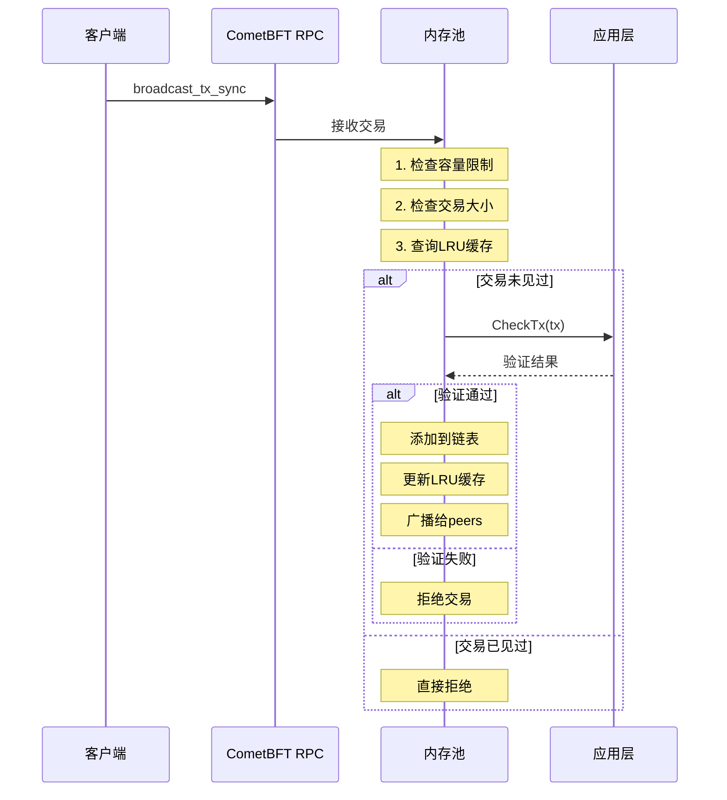
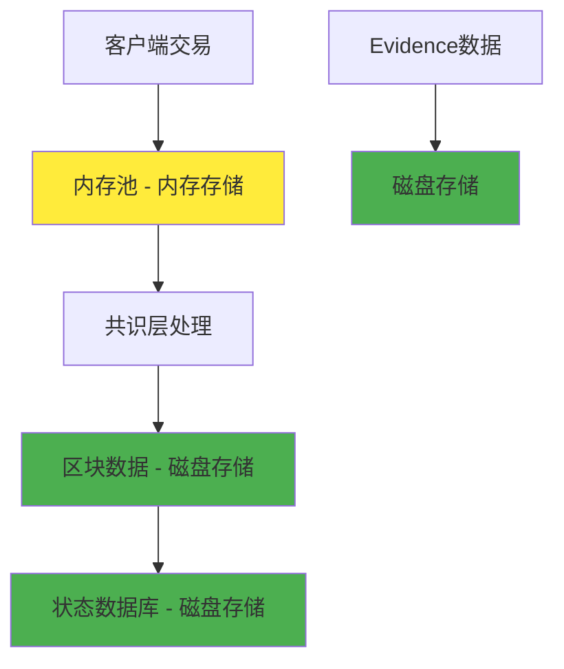

# 内存池（Mempool）数据存储机制分析

## 文档概述

本文档详细分析 Cosmos SDK 和 CometBFT 中内存池（Mempool）的数据存储机制，解答内存池数据是存储在内存中还是数据库中的问题，并深入探讨其设计原理和实现细节。

---

## 一、核心结论

**内存池的数据确实是存储在内存中的，而不是数据库中。**

这是 CometBFT 官方文档明确说明的设计决策，具有重要的性能和架构意义。

---

## 二、官方文档证据

### 2.1 定义确认

根据 CometBFT 官方文档：

> **A mempool (a contraction of memory and pool) is a node's data structure for storing information on uncommitted transactions.**

内存池本质上就是一个内存数据结构，用于存储未提交的交易信息。

### 2.2 持久化策略

配置文档中明确指出：

> **The mempool implementation does not persist any transaction data to disk (unlike evidence).**

内存池实现不会将任何交易数据持久化到磁盘，这与证据（evidence）数据的处理方式不同。

---

## 三、内存池的具体实现

### 3.1 Flood Mempool 架构

CometBFT 目前支持两种内存池类型，主要使用的是 **flood mempool**：

```go
// Flood Mempool 的核心组件
type FloodMempool struct {
    // 并发链表：存储交易的主要数据结构
    txs *clist.CList
    
    // LRU 缓存：快速检查重复交易
    cache *lru.ARCCache
    
    // 配置参数
    config *config.MempoolConfig
    
    // 其他字段...
}
```

### 3.2 数据结构详解

#### 并发链表（Concurrent Linked List）
- **用途**：存储待处理的交易
- **特点**：支持并发访问，线程安全
- **操作**：支持快速插入和删除

#### LRU 缓存
- **用途**：记录已见过的交易，防止重复处理
- **大小**：通过 `cache_size` 配置参数控制
- **机制**：最近最少使用算法，自动淘汰旧记录

### 3.3 内存限制机制

```go
// 内存池容量控制
type MempoolConfig struct {
    // 最大交易数量
    Size int `mapstructure:"size"`
    
    // 最大总字节数
    MaxTxsBytes int64 `mapstructure:"max_txs_bytes"`
    
    // 单个交易最大字节数
    MaxTxBytes int `mapstructure:"max_tx_bytes"`
    
    // 缓存大小
    CacheSize int `mapstructure:"cache_size"`
}
```

---

## 四、交易处理流程

### 4.1 交易进入内存池



### 4.2 内存池清理机制

```go
// RecheckTx：区块提交后的重新检查
func (mem *CListMempool) Update(
    height int64,
    txs types.Txs,
    deliverTxResponses []*abci.ResponseDeliverTx,
    preCheck PreCheckFunc,
    postCheck PostCheckFunc,
) error {
    // 1. 移除已上链的交易
    for _, tx := range txs {
        mem.removeTx(tx, false)
    }
    
    // 2. 重新检查剩余交易（如果启用）
    if mem.config.Recheck {
        mem.recheckTxs()
    }
    
    return nil
}
```

---

## 五、为什么使用内存存储？

### 5.1 性能优势

| 存储类型 | 访问速度 | 适用场景 |
|----------|----------|----------|
| **内存** | 纳秒级 | 频繁读写的临时数据 |
| **SSD** | 微秒级 | 持久化存储 |
| **HDD** | 毫秒级 | 大容量存储 |

内存访问速度比磁盘快几个数量级，对于需要快速验证和传播的交易来说至关重要。

### 5.2 设计原理

#### 临时性质
```go
// 交易的生命周期
type TransactionLifecycle struct {
    // 1. 接收阶段
    Received time.Time
    
    // 2. 验证阶段（CheckTx）
    Validated bool
    
    // 3. 内存池阶段
    InMempool bool
    
    // 4. 提案阶段
    Proposed bool
    
    // 5. 最终状态（二选一）
    Committed bool  // 成功上链
    Expired   bool  // 被淘汰
}
```

#### 实时处理需求
- **快速验证**：CheckTx 需要立即响应
- **网络传播**：合法交易需要快速广播
- **提案构建**：提案者需要快速选择交易

### 5.3 资源管理

```go
// 内存使用监控
func (mem *CListMempool) Size() int {
    return mem.txs.Len()
}

func (mem *CListMempool) TxsBytes() int64 {
    return atomic.LoadInt64(&mem.txsBytes)
}

// 容量检查
func (mem *CListMempool) isFull(txSize int) error {
    var (
        memSize  = mem.Size()
        txsBytes = mem.TxsBytes()
    )

    if memSize >= mem.config.Size || 
       int64(txSize)+txsBytes > mem.config.MaxTxsBytes {
        return ErrMempoolIsFull
    }
    return nil
}
```

---

## 六、与持久化存储的对比

### 6.1 存储层次架构



### 6.2 数据分类对比

| 数据类型 | 存储位置 | 持久化 | 生命周期 | 用途 |
|----------|----------|--------|----------|------|
| **未确认交易** | 内存池（内存） | 否 | 临时 | 等待打包 |
| **已确认交易** | 区块数据（磁盘） | 是 | 永久 | 历史记录 |
| **应用状态** | 状态数据库（磁盘） | 是 | 永久 | 当前状态 |
| **恶意证据** | Evidence存储（磁盘） | 是 | 长期 | 安全审计 |

---

## 七、内存池的两种类型

### 7.1 Flood Mempool（默认）

```go
// 特点：
// 1. 使用并发链表存储交易
// 2. 自动广播交易给peers
// 3. 支持LRU缓存去重
// 4. 按接收顺序排序

type FloodMempool struct {
    // 核心数据结构
    txs   *clist.CList    // 交易链表
    cache *lru.ARCCache   // 重复检查缓存
    
    // 配置和状态
    config *config.MempoolConfig
    height int64
    txsBytes int64
}
```

### 7.2 Nop Mempool（无操作）

```go
// 特点：
// 1. 不存储任何交易
// 2. 不进行网络广播
// 3. 应用层自建内存池
// 4. 适用于特殊场景

type NopMempool struct{}

func (NopMempool) CheckTx(tx types.Tx, cb func(*abci.Response), txInfo TxInfo) error {
    return nil // 什么都不做
}
```

---

## 八、实际运行影响

### 8.1 节点重启的影响

```bash
# 节点重启前
$ gaiad query mempool list
{
  "txs": [
    "CowBCo...",  # 交易1
    "DpxCDp...",  # 交易2
    "EqyCEq..."   # 交易3
  ]
}

# 节点重启后
$ gaiad query mempool list
{
  "txs": []  # 内存池为空
}
```

**原因**：内存数据在进程重启时丢失，需要通过网络重新同步。

### 8.2 内存使用监控

```bash
# 查看内存池状态
$ gaiad query mempool list | jq '.txs | length'
42

# 查看内存池字节数
$ gaiad status | jq '.sync_info.mempool_size'
"42"
```

### 8.3 网络恢复机制

```go
// P2P网络自动同步
func (r *Reactor) broadcastTxRoutine(peer p2p.Peer) {
    for {
        select {
        case memTx := <-r.mempool.TxsAvailable():
            // 广播新交易给peer
            r.sendTx(peer, memTx.tx)
        case <-peer.Quit():
            return
        }
    }
}
```

---

## 九、配置优化建议

### 9.1 内存池配置

```toml
# config.toml 中的内存池配置
[mempool]
# 内存池类型
type = "flood"

# 最大交易数量
size = 5000

# 最大总字节数（约100MB）
max_txs_bytes = 104857600

# 单个交易最大字节数（1MB）
max_tx_bytes = 1048576

# LRU缓存大小
cache_size = 10000

# 是否在区块提交后重新检查
recheck = true

# 是否广播交易
broadcast = true
```

### 9.2 性能调优

```go
// 根据硬件配置调整参数
func OptimizeMempoolConfig(ramGB int, networkBandwidth int) *MempoolConfig {
    return &MempoolConfig{
        // 内存越大，可存储更多交易
        Size: ramGB * 1000,
        
        // 带宽越大，可处理更大的交易
        MaxTxsBytes: int64(networkBandwidth * 1024 * 1024),
        
        // 缓存大小与交易数量成正比
        CacheSize: ramGB * 2000,
    }
}
```

---

## 十、常见问题解答

### Q1: 内存池数据丢失怎么办？
**A**: 这是正常现象。未确认交易会通过P2P网络重新传播，客户端可以重新广播交易。

### Q2: 如何防止内存池占用过多内存？
**A**: 通过配置 `size`、`max_txs_bytes` 等参数限制内存使用，超出限制的交易会被拒绝。

### Q3: 为什么不把内存池数据存储到数据库？
**A**: 
- 性能考虑：内存访问比磁盘快几个数量级
- 设计简洁：未确认交易本质上是临时数据
- 资源管理：避免磁盘空间被临时数据占用

### Q4: 内存池满了会怎样？
**A**: 新的交易会被拒绝，返回 "mempool is full" 错误，客户端需要稍后重试。

---

## 十一、总结

内存池采用纯内存存储是区块链系统的标准设计，这种设计：

### 优势
1. **高性能**：纳秒级访问速度，支持高频交易处理
2. **简洁性**：符合未确认交易的临时性质
3. **实时性**：支持快速验证和网络传播
4. **资源效率**：避免不必要的磁盘I/O

### 权衡
1. **易失性**：节点重启会丢失数据
2. **容量限制**：受物理内存限制
3. **网络依赖**：需要P2P网络同步

### 最佳实践
1. 合理配置内存池参数
2. 监控内存使用情况
3. 实现交易重发机制
4. 考虑网络分区恢复

这种设计在性能、简洁性和资源使用之间取得了良好的平衡，是现代区块链系统的核心组件之一。