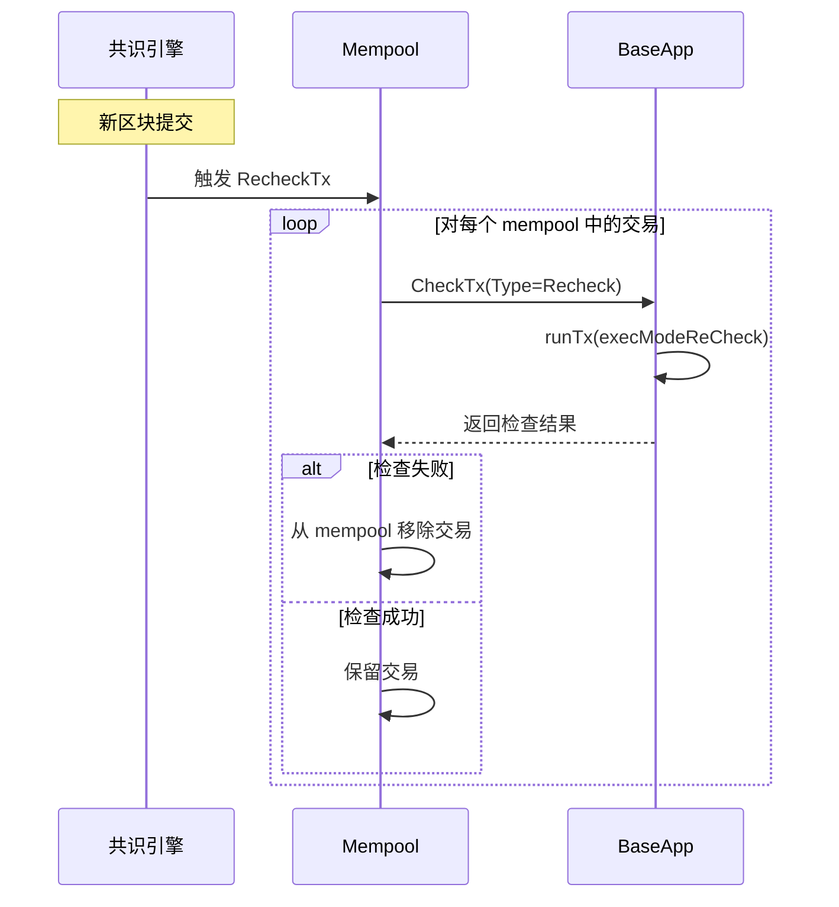

# CheckTx 方法实际位置与实现

## 文档概述

本文档澄清了 `CheckTx` 方法的实际位置，并提供了其在 Cosmos SDK v0.53.4 中的具体实现代码。

---

## 一、CheckTx 方法的实际位置

### 1.1 正确的文件路径

**实际位置**：
```
/Users/chupengfei/.gvm/pkgsets/go1.25.0/global/pkg/mod/github.com/cosmos/cosmos-sdk@v0.53.4/baseapp/abci.go
```

**行号**：第 340 行

### 1.2 为什么之前找不到

1. **文件名混淆**：
   - ❌ 错误：在 `baseapp.go` 中查找
   - ✅ 正确：在 `abci.go` 中查找

2. **版本确认**：
   - 当前 Gaia 项目使用 Cosmos SDK v0.53.4（在 `go.mod` 第 20 行确认）
   - 路径中的版本号是正确的

3. **文件结构**：
   ```
   baseapp/
   ├── abci.go          ← CheckTx 在这里！
   ├── baseapp.go       ← BaseApp 结构体定义
   ├── options.go
   ├── msg_service_router.go
   └── ...
   ```

---

## 二、CheckTx 方法的完整实现

### 2.1 方法签名和核心逻辑

```go
// 文件：github.com/cosmos/cosmos-sdk@v0.53.4/baseapp/abci.go:340
func (app *BaseApp) CheckTx(req *abci.RequestCheckTx) (*abci.ResponseCheckTx, error) {
    var mode execMode

    // 1. 根据请求类型确定执行模式
    switch req.Type {
    case abci.CheckTxType_New:
        mode = execModeCheck        // 新交易检查

    case abci.CheckTxType_Recheck:
        mode = execModeReCheck      // 重新检查（RecheckTx）

    default:
        return nil, fmt.Errorf("unknown RequestCheckTx type: %s", req.Type)
    }

    // 2. 如果没有自定义 checkTxHandler，使用默认逻辑
    if app.checkTxHandler == nil {
        // 执行交易（只运行 AnteHandler，不运行 Msg Handler）
        gInfo, result, anteEvents, err := app.runTx(mode, req.Tx, nil)
        if err != nil {
            return sdkerrors.ResponseCheckTxWithEvents(err, gInfo.GasWanted, gInfo.GasUsed, anteEvents, app.trace), nil
        }

        // 返回成功响应
        return &abci.ResponseCheckTx{
            GasWanted: int64(gInfo.GasWanted),
            GasUsed:   int64(gInfo.GasUsed),
            Log:       result.Log,
            Data:      result.Data,
            Events:    sdk.MarkEventsToIndex(result.Events, app.indexEvents),
        }, nil
    }

    // 3. 如果有自定义 checkTxHandler，使用自定义逻辑
    runTx := func(txBytes []byte, tx sdk.Tx) (gInfo sdk.GasInfo, result *sdk.Result, anteEvents []abci.Event, err error) {
        return app.runTx(mode, txBytes, tx)
    }

    return app.checkTxHandler(runTx, req)
}
```

### 2.2 关键参数说明

| 参数 | 类型 | 说明 |
|------|------|------|
| `req.Type` | `abci.CheckTxType` | 检查类型：`New`（新交易）或 `Recheck`（重检） |
| `req.Tx` | `[]byte` | 交易的字节数组 |
| `mode` | `execMode` | 执行模式：`execModeCheck` 或 `execModeReCheck` |

### 2.3 执行模式详解

```go
// 执行模式常量（在 baseapp.go 中定义）
const (
    execModeCheck    execMode = iota  // CheckTx 模式：只执行 AnteHandler
    execModeReCheck                   // RecheckTx 模式：重新检查
    execModeSimulate                  // 模拟模式：用于 gas 估算
    execModeFinalize                  // FinalizeBlock 模式：完整执行
)
```

---

## 三、GaiaApp 如何继承 CheckTx

### 3.1 继承机制

```go
// 文件：app/app.go:101
type GaiaApp struct {
    *baseapp.BaseApp    // 嵌入 BaseApp，自动获得 CheckTx 方法
    keepers.AppKeepers
    // ... 其他字段
}
```

### 3.2 调用链路

```
客户端调用：app.CheckTx(req)
    ↓ (Go 嵌入语法)
实际调用：app.BaseApp.CheckTx(req)
    ↓ (Cosmos SDK 实现)
执行：baseapp/abci.go:340 的 CheckTx 方法
```

---

## 四、CheckTx 与 runTx 的关系

### 4.1 runTx 方法的作用

`CheckTx` 内部调用 `app.runTx(mode, req.Tx, nil)`，这是交易执行的核心方法：

```go
// runTx 方法签名（概念性）
func (app *BaseApp) runTx(mode execMode, txBytes []byte, tx sdk.Tx) (
    gInfo sdk.GasInfo, 
    result *sdk.Result, 
    anteEvents []abci.Event, 
    err error
)
```

### 4.2 不同模式下的 runTx 行为

| 模式 | AnteHandler | Msg Handler | 状态变更 |
|------|-------------|-------------|----------|
| `execModeCheck` | ✅ 执行 | ❌ 跳过 | ❌ 不变更 |
| `execModeReCheck` | ✅ 执行 | ❌ 跳过 | ❌ 不变更 |
| `execModeFinalize` | ✅ 执行 | ✅ 执行 | ✅ 变更状态 |

---

## 五、CheckTx 的两种类型

### 5.1 CheckTxType_New

- **触发时机**：客户端首次广播交易
- **目的**：验证交易是否可以进入 mempool
- **执行模式**：`execModeCheck`

### 5.2 CheckTxType_Recheck

- **触发时机**：新区块提交后，对 mempool 中剩余交易的重新检查
- **目的**：清理因状态变化而失效的交易
- **执行模式**：`execModeReCheck`

### 5.3 RecheckTx 的工作流程



---

## 六、自定义 CheckTx Handler

### 6.1 checkTxHandler 字段

BaseApp 允许应用程序设置自定义的 `checkTxHandler`：

```go
// BaseApp 结构体中的字段
type BaseApp struct {
    // ...
    checkTxHandler CheckTxHandler  // 自定义 CheckTx 处理器
    // ...
}

// CheckTxHandler 类型定义
type CheckTxHandler func(
    runTx func([]byte, sdk.Tx) (sdk.GasInfo, *sdk.Result, []abci.Event, error),
    req *abci.RequestCheckTx,
) (*abci.ResponseCheckTx, error)
```

### 6.2 Gaia 的 CheckTx 配置

在当前 Gaia 实现中：
- **没有设置自定义 `checkTxHandler`**
- 使用默认的 CheckTx 逻辑（直接调用 `runTx`）
- 通过 AnteHandler 链实现所有验证逻辑

---

## 七、调试和验证

### 7.1 验证 CheckTx 方法存在

```bash
# 在 Go 模块缓存中查找 CheckTx
grep -n "func.*CheckTx" /Users/chupengfei/.gvm/pkgsets/go1.25.0/global/pkg/mod/github.com/cosmos/cosmos-sdk@v0.53.4/baseapp/abci.go

# 输出：340:func (app *BaseApp) CheckTx(req *abci.RequestCheckTx) (*abci.ResponseCheckTx, error) {
```

### 7.2 查看完整实现

```bash
# 查看 CheckTx 方法的完整实现（第 340-380 行）
sed -n '340,380p' /Users/chupengfei/.gvm/pkgsets/go1.25.0/global/pkg/mod/github.com/cosmos/cosmos-sdk@v0.53.4/baseapp/abci.go
```

### 7.3 验证 GaiaApp 继承

```bash
# 在 Gaia 项目中验证 BaseApp 嵌入
grep -n "baseapp.BaseApp" /Users/chupengfei/code/web3_community/cosmos_ws/gaia/app/app.go

# 输出：101:	*baseapp.BaseApp
```

---

## 八、相关文件位置总结

| 组件 | 文件路径 | 说明 |
|------|----------|------|
| **CheckTx 实现** | `cosmos-sdk@v0.53.4/baseapp/abci.go:340` | CheckTx 方法的实际实现 |
| **BaseApp 定义** | `cosmos-sdk@v0.53.4/baseapp/baseapp.go` | BaseApp 结构体定义 |
| **GaiaApp 定义** | `app/app.go:101` | GaiaApp 嵌入 BaseApp |
| **执行模式常量** | `cosmos-sdk@v0.53.4/baseapp/baseapp.go` | execMode 常量定义 |
| **runTx 实现** | `cosmos-sdk@v0.53.4/baseapp/baseapp.go` | runTx 方法实现 |

---

## 九、关键要点总结

1. **CheckTx 在 abci.go 中**：不是在 baseapp.go，而是在 abci.go 文件的第 340 行

2. **版本匹配**：Gaia v25 使用 Cosmos SDK v0.53.4，路径中的版本号是正确的

3. **继承机制**：GaiaApp 通过嵌入 `*baseapp.BaseApp` 自动获得 CheckTx 方法

4. **执行逻辑**：
   - 区分 `New` 和 `Recheck` 两种类型
   - 调用 `runTx` 方法执行 AnteHandler
   - 不执行 Msg Handler，不修改状态

5. **可扩展性**：支持自定义 `checkTxHandler`，但 Gaia 使用默认实现

6. **调试方法**：可以通过 Go 模块缓存路径直接查看源码

---

## 附录：快速查找命令

```bash
# 查找 CheckTx 方法位置
find ~/.gvm/pkgsets/go1.25.0/global/pkg/mod/github.com/cosmos/cosmos-sdk@v0.53.4 -name "*.go" -exec grep -l "func.*CheckTx" {} \;

# 查看 CheckTx 实现
grep -A 40 "func.*CheckTx" ~/.gvm/pkgsets/go1.25.0/global/pkg/mod/github.com/cosmos/cosmos-sdk@v0.53.4/baseapp/abci.go

# 验证 Gaia 版本
grep "cosmos-sdk" /Users/chupengfei/code/web3_community/cosmos_ws/gaia/go.mod
```